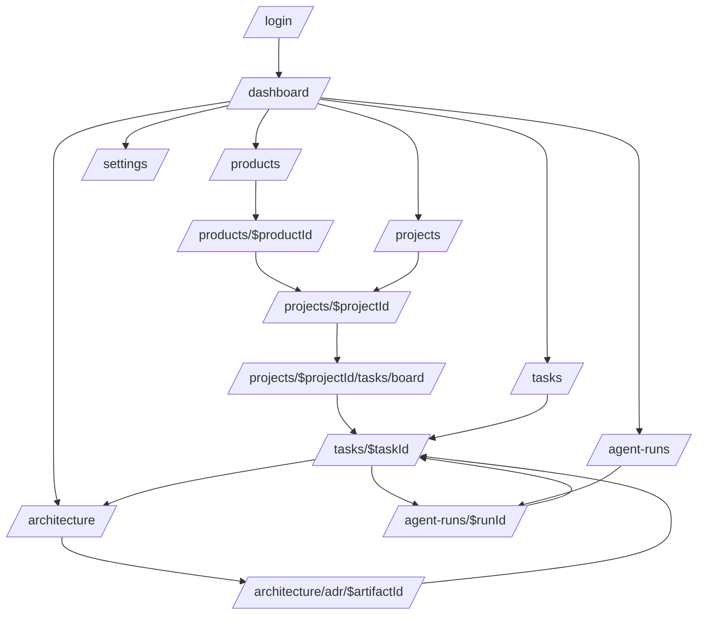

# Tomodachi MVP UI/UX Flow Plan

## 목적

이 문서는 Tomodachi MVP에서 사용자가 처음 보게 되는 main UI, 화면별 노출 데이터, 이동 흐름, 상태 처리, 연결 페이지를 정의한다. 구현자는 이 문서를 기준으로 `React + Vite + TypeScript + shadcn/ui + Zustand + TanStack Query + TanStack Router` 프론트엔드를 설계하고, Tomodachi backend API를 canonical data source로 사용한다.

## 근거

- MVP 실행 계획: `../../.omo/plans/tomodachi-mvp.md`
- 원본 PRD 보존본: `../../.omo/evidence/tomodachi-mvp/source/Tomodachi_planning.md.md`
- shadcn dashboard 참고 파일: `../../.omo/evidence/tomodachi-mvp/source/shadcn-dashboard-landing-template-65fc112/`

## UI 방향

Tomodachi는 마케팅 페이지가 아니라 내부 제품 운영 도구다. 첫 화면은 설명형 landing page가 아니라 실제 업무 상태를 바로 보여주는 authenticated dashboard여야 한다.

시각 방향은 Linear 계열의 정밀한 운영형 대시보드를 기준으로 잡는다. 짙은 panel 기반 UI, 얇은 border, 낮은 채도, 정보 밀도 높은 table/list/board, restrained accent color를 사용한다. 단, MVP에서는 dark-only 고정이 아니라 shadcn token 기반 light/dark 대응을 열어 둔다.

디자인 원칙:

- 좌측 sidebar + 중앙 작업 영역 + 우측 detail panel을 기본 구조로 둔다.
- dashboard card는 장식이 아니라 drill-down 가능한 상태 요약이어야 한다.
- task, architecture artifact, agent run은 같은 탐색 모델 안에서 연결되어야 한다.
- OpenCode 관련 raw data는 직접 노출하지 않고 backend가 정리한 summary/evidence/unresolved item만 보여준다.
- 빈 상태, 권한 제한, 로딩, 오류, 충돌 상태를 화면별로 명시한다.
- route/search state만으로 같은 문맥을 복원할 수 있어야 한다.

## 정보 구조



## App Shell

### Layout

```text
┌────────────────────────────────────────────────────────────────────────────┐
│ Top bar: product switcher | global search | command | sync health | user   │
├───────────────┬──────────────────────────────────────────────┬─────────────┤
│ Sidebar       │ Main content                                 │ Detail      │
│               │ route-owned dashboard/list/board/table       │ optional    │
│ Lifecycle     │                                              │ panel       │
│ Architecture  │                                              │             │
│ Agent Runs    │                                              │             │
│ Settings      │                                              │             │
└───────────────┴──────────────────────────────────────────────┴─────────────┘
```

### Sidebar groups

| Group | Item | Route | 노출 조건 |
|---|---|---|---|
| Overview | Dashboard | `/` | authenticated |
| Lifecycle | Products | `/products` | `product:read` |
| Lifecycle | Projects | `/projects` | `project:read` |
| Lifecycle | Tasks | `/tasks` | `task:read` |
| Knowledge | Architecture | `/architecture` | `artifact:read` |
| Agent | Agent Runs | `/agent-runs` | `task:read` 또는 `agent-run:read` |
| Operations | Settings | `/settings` | role별 부분 노출 |

### Top bar data

| 영역 | 데이터 | Source |
|---|---|---|
| Product switcher | product name, status, active project count | `GET /api/products` |
| Global search | task, project, artifact, agent run result | `GET /api/search` |
| Command palette | route shortcuts, create task, transition task | route config + permission map |
| Sync health | last OpenCode sync, failed webhook count | backend summary endpoint |
| User menu | name, role, scopes | `GET /api/auth/me` |

## Main Dashboard

Route: `/`

Dashboard는 첫 화면이다. 사용자는 로그인 후 바로 제품 상태, 막힌 작업, agent review queue를 확인해야 한다.

### First viewport

```text
┌────────────────────────────────────────────────────────────────────────────┐
│ Product: Tomodachi                   Range: 7d | 30d | All                │
├─────────────────┬─────────────────┬─────────────────┬────────────────────┤
│ Active Projects │ Tasks In Flight │ Blocked Tasks   │ Agent Review Queue │
│ count + delta   │ count + trend   │ count + top 3   │ count + latest run │
├──────────────────────────────────────────────┬─────────────────────────────┤
│ Workstream overview                          │ Review required             │
│ project rows with progress/status            │ agent runs + unresolved      │
├──────────────────────────────────────────────┴─────────────────────────────┤
│ Architecture coverage: linked tasks, accepted ADR, stale artifact warnings │
└────────────────────────────────────────────────────────────────────────────┘
```

### 표시 데이터

| Block | 표시 데이터 | Click target |
|---|---|---|
| Active Projects | active project count, status breakdown, updated time | `/projects?status=active` |
| Tasks In Flight | Ready, In Progress, Review, QA counts | `/tasks?status=InProgress,Review,QA` |
| Blocked Tasks | blocked count, top blocked task title/age/owner | `/tasks?status=Blocked` |
| Agent Review Queue | review-required run count, latest failed/completed runs | `/agent-runs?requiresReview=true` |
| Workstream overview | project key, name, owner, due, progress, blocker count | `/projects/$projectId` |
| Architecture coverage | linked artifact ratio, stale artifact count, accepted ADR count | `/architecture` |

### Empty/Error states

| 상태 | UI 처리 |
|---|---|
| Product 없음 | "Create first product" action은 Admin/Product Manager에게만 노출 |
| Project 없음 | empty dashboard with product summary and create project action |
| Agent run 없음 | "No agent runs imported yet"와 task context setup link |
| Search/API 실패 | 해당 panel 단위 error, 전체 dashboard blank 처리 금지 |
| 권한 부족 | card는 hidden보다 disabled summary를 우선, sensitive action만 숨김 |

## Products

### `/products`

제품 목록은 lifecycle root 탐색 화면이다.

| UI 영역 | 표시 데이터 |
|---|---|
| Header | total products, active products, archived products |
| Filter bar | status, owner, updated range |
| Table | code, name, status, workspace count, active project count, open task count, last activity |
| Row action | open product, copy product code, archive if permitted |

### `/products/$productId`

제품 상세는 dashboard보다 좁은 product context 화면이다.

| Tab | 표시 데이터 | 연결 |
|---|---|---|
| Overview | product health, active projects, blockers, recent activity | project/task/detail |
| Workspaces | workspace list, project count, owner | `/workspaces/$workspaceId` |
| Projects | active/completed project table | `/projects/$projectId` |
| Architecture | artifact coverage and stale references | `/architecture?productId=$productId` |
| Agent Runs | product-scoped run history | `/agent-runs?productId=$productId` |

## Projects

### `/projects`

프로젝트 목록은 PM/Engineer가 가장 자주 쓰는 탐색 화면이다.

| UI 영역 | 표시 데이터 |
|---|---|
| Metric strip | active, blocked, review, done this week |
| Filter bar | product, workspace, status, owner, due range |
| Table/List | key, name, status, owner, task counts, linked artifact count, latest agent run |
| Saved views | My active, Blocked, Review needed, No architecture link |

### `/projects/$projectId`

프로젝트 상세는 세 가지 primary view를 가진다.

| View | 목적 | Main content | Right detail |
|---|---|---|---|
| Overview | project context | summary, progress, linked artifacts, recent activity | selected task/run |
| Board | execution | task columns by status | task detail panel |
| Artifacts | architecture link | linked ADR/RFC/API/diagram table | artifact preview |

### `/projects/$projectId/tasks/board`

Board는 drag-and-drop 없이도 빠른 상태 전이를 지원한다.

| Column | 포함 상태 | Card data |
|---|---|---|
| Ready | `Ready` | number, title, priority, assignee, artifact count |
| In Progress | `InProgress` | same + active agent run badge |
| Blocked | `Blocked` | same + blocked age/reason |
| Review | `Review` | same + reviewer/review-required |
| QA | `QA` | same + evidence count |
| Done | `Done` | collapsed by default in MVP |

Interaction:

1. Card click opens right-side `TaskDetailPanel`.
2. Status button opens transition dialog.
3. Valid transition optimistic-patches card and detail.
4. Backend error rolls back and shows inline error + toast.
5. URL search retains `status`, `assignee`, `priority`, `selectedTaskId`.

## Tasks

### `/tasks`

전체 task table은 운영자가 cross-project로 작업을 찾는 화면이다.

| Column | Data | Interaction |
|---|---|---|
| Number | task number | click opens detail |
| Title | title, project key | search/filter |
| Status | enum label + color token | faceted filter |
| Priority | priority badge | sort/filter |
| Assignee | user display name | filter |
| Linked Artifacts | count + first artifact type | opens filtered Architecture |
| Agent Runs | latest run status, review flag | opens Agent Run |
| Updated | relative time | sort |

### `/tasks/$taskId`

Task detail은 full page와 side panel 두 형태를 공유한다.

| Section | 표시 데이터 |
|---|---|
| Header | number, title, status, priority, assignee, project |
| Description | markdown/plain text, acceptance notes |
| Status transition | allowed next states, reason input, permission guard |
| Activity | transition, comment, artifact link, agent run events |
| Architecture links | linked ADR/RFC/diagram/API contract/domain model |
| Agent runs | run summary, changed files count, evidence, unresolved items |
| Context bundle | compact task context preview for agent |

Primary actions:

- `Start work`: `Ready -> InProgress`
- `Send to review`: `InProgress -> Review`
- `Send to QA`: `Review -> QA`
- `Mark done`: `Review|QA -> Done`
- `Link artifact`
- `Create task context bundle`

## Architecture

### `/architecture`

Architecture registry는 문서 저장소가 아니라 "task와 연결된 architecture knowledge index"다.

| UI 영역 | 표시 데이터 |
|---|---|
| Summary cards | accepted ADR, proposed RFC, stale links, unlinked tasks |
| Filters | type, status, product, linkedTaskId, sourceKind |
| Table/card list | type, title, status, source path, linked task count, updated |
| Warnings | stale git ref, no linked task, generated-only artifact |

### `/architecture/adr/$artifactId`

| Section | 표시 데이터 |
|---|---|
| Header | type, title, status, source kind, git ref |
| Summary | rationale summary, decision date, owner |
| Linked tasks | task number/title/status/agent run evidence |
| Source preview | Git path/ref metadata; MVP에서는 full editor 없음 |
| Activity | artifact status change, link/unlink events |

Navigation rule:

- Artifact detail에서 linked task를 클릭하면 `/tasks/$taskId?tab=architecture`로 이동한다.
- Task detail에서 artifact를 클릭하면 `/architecture/adr/$artifactId?fromTask=$taskId`로 이동한다.

## Agent Runs

### `/agent-runs`

Agent Runs는 OpenCode 실행 이력을 사람이 검토 가능한 단위로 보여준다.

| Column | Data |
|---|---|
| Run | run id, status |
| Agent | provider, model, agent name |
| Linked context | product, project, task |
| Changed files | count and top file path |
| Evidence | evidence count, missing evidence warning |
| Unresolved | unresolved item count |
| Review | requiresReview flag, reviewer |
| Time | started, finished, duration |

### `/agent-runs/$runId`

```text
┌────────────────────────────────────────────────────────────┐
│ Run summary: status | model | task | review required       │
├─────────────────────────────┬──────────────────────────────┤
│ Diff files                  │ Evidence and unresolved      │
│ file list + selected diff   │ grouped evidence, notes      │
├─────────────────────────────┴──────────────────────────────┤
│ Timeline: started, task transition, evidence attach, finish│
└────────────────────────────────────────────────────────────┘
```

중요 원칙:

- Frontend는 OpenCode server를 직접 호출하지 않는다.
- Agent raw session은 OpenCode 쪽 원본이고, Tomodachi UI는 backend가 수집/정규화한 metadata만 표시한다.
- `review required` 상태는 dashboard와 task detail에도 반영한다.

## Settings

MVP Settings는 전체 설정 화면이 아니라 운영에 필요한 최소 읽기/관리 화면이다.

| Section | MVP scope |
|---|---|
| Profile | current user, role, scopes |
| Roles | role/scopes read-only matrix |
| Integrations | OpenCode sync status, MCP tool list |
| Webhooks | delivery status, failed retry for admin |
| Appearance | theme token preview only; full customizer는 후순위 |

## 상태 처리

| State | 처리 기준 |
|---|---|
| Loading | page shell 유지, content area skeleton 사용 |
| Empty | 다음 행동이 명확한 empty state. 권한이 없으면 action 비노출 |
| Error | page 전체 error보다 panel-level recovery 우선 |
| Forbidden | route-level forbidden page 또는 action-level disabled + tooltip |
| Conflict | optimistic update rollback, current server state refetch |
| Stale sync | agent run/task context panel에 stale badge 표시 |
| Offline backend | login 이후 API unreachable banner, cached UI만 표시하지 않음 |

## URL State

| 화면 | URL state |
|---|---|
| Dashboard | `productId`, `range` |
| Projects | `productId`, `status`, `owner`, `view` |
| Project Detail | `view`, `selectedTaskId`, `artifactType` |
| Task Board | `status`, `assignee`, `priority`, `selectedTaskId` |
| Tasks | `status`, `priority`, `projectId`, `q`, `sort` |
| Architecture | `type`, `status`, `linkedTaskId`, `q` |
| Agent Runs | `status`, `requiresReview`, `taskId`, `model` |

Zustand는 sidebar collapse, command palette open, right panel state 같은 UI-local state만 담당한다. Server state는 TanStack Query가 담당하고, 화면 문맥은 TanStack Router search params가 담당한다.

## Responsive Behavior

| Width | Behavior |
|---|---|
| 1280px 이상 | sidebar + main + right detail panel 3-column |
| 768px-1279px | sidebar + main, detail은 sheet/drawer |
| 375px-767px | sidebar collapsed, top search compact, list/table은 card list로 전환 |

Mobile에서도 기능을 숨기지 않는다. 다만 board는 columns를 horizontal scroll로 두지 않고 status segmented control + card list로 전환한다.

## MVP 우선순위

### Alpha UI

1. `/login`
2. AppShell
3. `/`
4. `/projects`
5. `/projects/$projectId`
6. `/projects/$projectId/tasks/board`
7. `/tasks`
8. `/tasks/$taskId`

### Beta UI

1. `/architecture`
2. `/architecture/adr/$artifactId`
3. `/agent-runs`
4. `/agent-runs/$runId`
5. `/settings`

### 후순위

- Release timeline
- Advanced graph visualization
- Full document editor
- Advanced keyboard shortcuts
- Full theme customizer
- External customer portal

## Acceptance Checklist

- Main dashboard가 product/project/task/agent/architecture 상태를 첫 화면에서 보여준다.
- 모든 주요 dashboard card는 연결 route를 가진다.
- Task board와 task detail은 같은 status transition contract를 사용한다.
- Task detail에서 architecture artifact와 agent run으로 이동할 수 있다.
- Architecture detail에서 linked task로 되돌아갈 수 있다.
- Agent run detail은 diff/evidence/unresolved/review-required 정보를 모두 보여준다.
- Frontend는 Tomodachi backend만 호출한다.
- URL 공유로 같은 product/project/task/tab/filter 문맥이 복원된다.
- Loading, empty, error, forbidden, conflict, stale sync 상태가 화면별로 존재한다.
- `Tomodachi/research`는 UI/UX 문서 생성과 무관하게 보존된다.
