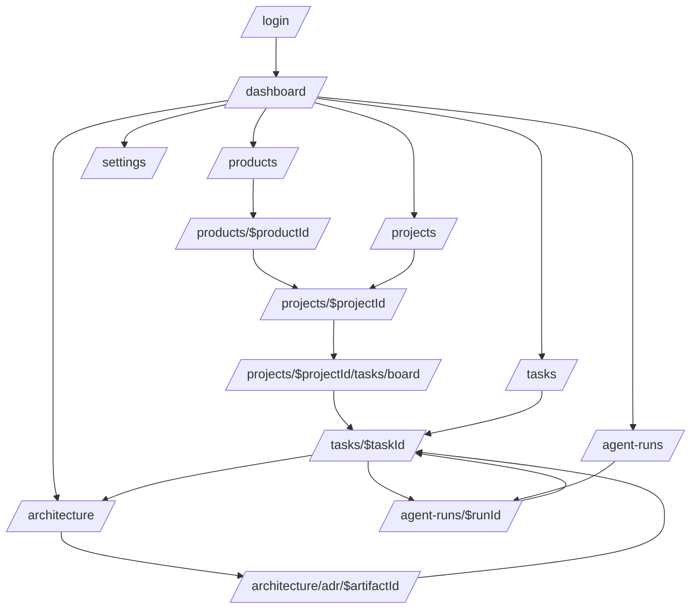

# Tomodachi MVP UI/UX 흐름 계획

<!-- ui-contract-plan: v1 -->

**계약 검증 기준:** repository `0a07266d53b83cd07017ec912c616eecbcc3d693` / UI 계획 원본 `49640fc67d3384f04a13878b6a3b6cfc7fb3687d` / 로그인 계약 갱신 2026-07-12 KST

## 목적

이 문서는 Tomodachi MVP에서 사용자가 처음 보게 되는 main UI, 화면별 노출 데이터, 이동 흐름, 상태 처리, 연결 페이지를 정의한다. 현재 구현은 mock query boundary를 사용하는 운영 UI이며 backend 연동은 아직 활성화하지 않는다. 아래에서 `Current`는 현재 source에 존재하는 계약, `Planned`는 구현 전 인수 테스트가 필요한 계약을 뜻한다. 상세 UX 절은 목표 화면을 보존하되, 구현 여부는 이 구분과 machine-readable matrix를 우선한다.

## 근거

- 현재 frontend route: `front/src/router.tsx`
- 현재 frontend view model과 mock boundary: `front/src/types.ts`, `front/src/data/`, `front/src/mockData.ts`
- 현재 data-source gate: `front/src/config/appConfig.ts`의 `dataSource: "mock"`, `backendIntegrationEnabled: false`
- 현재 backend endpoint와 DTO: `backend/src/main/kotlin/com/tomodachi/backend/api/`, `backend/src/main/kotlin/com/tomodachi/backend/api/Dto.kt`
- 문서 원본 Git 근거: commit `49640fc67d3384f04a13878b6a3b6cfc7fb3687d`의 `plan/ui-ux-mvp-flow.md`
- 검증 가능한 계약 matrix: `plan/history/ui-contract-matrix.json`

## 현재 MVP 계약

현재 UI route는 `front/src/router.tsx`에 선언된 13개 route다. `/login`은 인증 API만 직접 호출하며, 나머지 화면 데이터는 frontend mock query boundary가 소유한다. backend controller가 존재하더라도 frontend의 production data source로 연결됐다는 뜻은 아니다.

| 상태 | Route | Owner | Source | 인수 테스트 |
| --- | --- | --- | --- | --- |
| Current | `/` | Frontend | `front/src/router.tsx` | router parser가 route를 찾고 matrix의 Current 집합과 정확히 일치한다. |
| Current | `/products` | Frontend | `front/src/router.tsx` | 제품 목록 화면이 mock query boundary에서 렌더링된다. |
| Current | `/projects` | Frontend | `front/src/router.tsx` | 프로젝트 목록 route가 build/typecheck를 통과한다. |
| Current | `/projects/$projectId` | Frontend | `front/src/router.tsx` | project id route parameter로 상세 화면을 연다. |
| Current | `/projects/$projectId/tasks/board` | Frontend | `front/src/router.tsx` | project board route가 현재 router tree에 포함된다. |
| Current | `/tasks` | Frontend | `front/src/router.tsx` | task 목록 route가 현재 router tree에 포함된다. |
| Current | `/tasks/$taskId` | Frontend | `front/src/router.tsx` | task id route parameter로 상세 화면을 연다. |
| Current | `/architecture` | Frontend | `front/src/router.tsx` | architecture 목록 route가 현재 router tree에 포함된다. |
| Current | `/architecture/adr/$artifactId` | Frontend | `front/src/router.tsx` | artifact id route parameter로 상세 화면을 연다. |
| Current | `/agent-runs` | Frontend | `front/src/router.tsx` | agent run 목록 route가 현재 router tree에 포함된다. |
| Current | `/agent-runs/$runId` | Frontend | `front/src/router.tsx` | run id route parameter로 상세 화면을 연다. |
| Current | `/settings` | Frontend | `front/src/router.tsx` | settings route가 현재 router tree에 포함된다. |
| Current | `/login` | Frontend/Auth | `front/src/router.tsx` | auth login 응답 adapter가 `POST /api/auth/login` 성공/401 계약과 함께 동작한다. |

현재 backend에서 이 문서가 이름으로 참조하는 API는 다음 둘이다. 이는 endpoint 구현 상태만 뜻하며 frontend 연동 상태는 아니다.

| 상태 | API claim | Owner | Source | 인수 테스트 |
| --- | --- | --- | --- | --- |
| Current | `GET /api/products` | Backend lifecycle | `backend/src/main/kotlin/com/tomodachi/backend/api/LifecycleController.kt` | validator가 controller mapping/source를 확인한다. 응답 shape MockMvc test는 frontend 연동 전 추가해야 하는 gap이다. |
| Current | `POST /api/auth/login` | Backend auth | `backend/src/main/kotlin/com/tomodachi/backend/api/AuthController.kt` | validator가 controller mapping/source를 확인하고, 성공 bearer token과 401 bad credentials MockMvc test가 계약을 고정한다. |

## Backend 연동 계획

아래 항목은 UX 목표에는 포함되지만 현재 router/controller 계약에는 없다. 구현 task는 owner의 source 변경, contract test, mock-to-adapter 검증을 먼저 완료해야 한다.

| 상태 | Route/API claim | Owner | Source target | 구현 전 인수 테스트 |
| --- | --- | --- | --- | --- |
| Planned | `/products/$productId` | Frontend/Lifecycle | `front/src/router.tsx` | product detail route와 product-detail MockMvc contract가 함께 통과한다. |
| Planned | `/workspaces/$workspaceId` | Frontend/Lifecycle | future route module | workspace detail route/API의 DTO와 navigation contract test가 먼저 승인된다. |
| Planned | `GET /api/search` | Backend search | future `SearchController.kt` | task/project/artifact/agent-run union response contract와 permission-filter MockMvc test가 통과한다. |
| Planned | `GET /api/auth/me` | Backend auth | `backend/src/main/kotlin/com/tomodachi/backend/api/AuthController.kt` | authenticated principal의 name/role/scopes DTO와 401/403 MockMvc test가 통과한다. |
| Planned | `GET /api/products/{productId}` | Backend lifecycle | `backend/src/main/kotlin/com/tomodachi/backend/api/LifecycleController.kt` | 존재/미존재 product에 대한 200/404 MockMvc contract가 통과한다. |
| Planned | `GET /api/integrations/opencode/sync-summary` | Backend integration | future `IntegrationController.kt` | last sync와 failed webhook count DTO, stale/error state contract test가 통과한다. |

연동 전환 gate는 adapter/fixture contract, panel 단위 loading/error/forbidden fallback, frontend typecheck/build, backend MockMvc contract, visual QA, rollback 확인이 모두 통과하는 것이다. 로그인은 인증 API에 한정된 예외이며, 그 외 화면은 `dataSource: "mock"`과 `backendIntegrationEnabled: false`를 유지한다.

## UI 방향

Tomodachi는 마케팅 페이지가 아니라 내부 제품 운영 도구다. 첫 화면은 설명형 landing page가 아니라 실제 업무 상태를 바로 보여주는 인증된 dashboard여야 한다.

시각 방향은 Linear 계열의 정밀한 운영형 대시보드를 기준으로 잡는다. 짙은 panel 기반 UI, 얇은 border, 낮은 채도, 정보 밀도 높은 table/list/board, 절제된 강조색을 사용한다. 단, MVP에서는 dark-only 고정이 아니라 shadcn token 기반 light/dark 대응을 열어 둔다.

디자인 원칙:

- 좌측 sidebar + 중앙 작업 영역 + 우측 detail panel을 기본 구조로 둔다.
- dashboard card는 장식이 아니라 상세 이동이 가능한 상태 요약이어야 한다.
- task, architecture artifact, agent run은 같은 탐색 모델 안에서 연결되어야 한다.
- OpenCode 관련 raw data는 직접 노출하지 않고 backend가 정리한 요약, 근거, 미해결 항목만 보여준다.
- 빈 상태, 권한 제한, 로딩, 오류, 충돌 상태를 화면별로 명시한다.
- route/search state만으로 같은 문맥을 복원할 수 있어야 한다.

## 정보 구조



## 앱 Shell

### 레이아웃

```text
┌────────────────────────────────────────────────────────────────────────────┐
│ 상단 바: 제품 전환 | 전역 검색 | 명령 | 동기화 상태 | 사용자        │
├───────────────┬──────────────────────────────────────────────┬─────────────┤
│ 사이드바      │ 주요 content                                  │ 상세        │
│               │ route 소유 dashboard/list/board/table        │ 선택        │
│ Lifecycle     │                                              │ panel       │
│ Architecture  │                                              │             │
│ Agent Runs    │                                              │             │
│ Settings      │                                              │             │
└───────────────┴──────────────────────────────────────────────┴─────────────┘
```

### 사이드바 그룹

| 그룹 | 항목 | Route | 노출 조건 |
|---|---|---|---|
| 개요 | Dashboard | `/` | 인증됨 |
| 제품 생명주기 | Products | `/products` | `product:read` |
| 제품 생명주기 | Projects | `/projects` | `project:read` |
| 제품 생명주기 | Tasks | `/tasks` | `task:read` |
| 지식 | Architecture | `/architecture` | `artifact:read` |
| Agent | Agent Runs | `/agent-runs` | `task:read` 또는 `agent-run:read` |
| 운영 | Settings | `/settings` | role별 부분 노출 |

### 상단 바 데이터

| 영역 | 데이터 | 계약 상태와 출처 |
|---|---|---|
| 제품 전환 | 제품명, 상태, 활성 project 수 | Current endpoint: `GET /api/products`; UI data source는 mock |
| 전역 검색 | task, project, artifact, agent run 결과 | Planned: `GET /api/search` |
| 명령 palette | route shortcut, task 생성, task 상태 전환 | route config + permission map |
| 동기화 상태 | 마지막 OpenCode sync, 실패한 webhook 수 | Planned: `GET /api/integrations/opencode/sync-summary` |
| 사용자 메뉴 | 이름, role, scope | Planned: `GET /api/auth/me` |

## 메인 Dashboard

Route: `/`

Dashboard는 첫 화면이다. 사용자는 로그인 후 바로 제품 상태, 막힌 작업, agent review queue를 확인해야 한다.

### 첫 viewport

```text
┌────────────────────────────────────────────────────────────────────────────┐
│ Product: Tomodachi                   Range: 7d | 30d | All                │
├─────────────────┬─────────────────┬─────────────────┬────────────────────┤
│ 활성 Projects │ 진행 중 Tasks │ Blocked Tasks   │ Agent Review Queue │
│ 수 + 변화량    │ 수 + 추세     │ 수 + 상위 3개   │ 수 + 최신 run       │
├──────────────────────────────────────────────┬─────────────────────────────┤
│ 작업 흐름 개요                              │ Review 필요                 │
│ progress/status가 있는 project row          │ agent run + 미해결 항목      │
├──────────────────────────────────────────────┴─────────────────────────────┤
│ Architecture coverage: linked tasks, accepted ADR, stale artifact warnings │
└────────────────────────────────────────────────────────────────────────────┘
```

### 표시 데이터

| 블록 | 표시 데이터 | 클릭 대상 |
|---|---|---|
| Active Projects | 활성 project 수, 상태 breakdown, updated time | `/projects?status=active` |
| Tasks In Flight | Ready, In Progress, Review, QA 수 | `/tasks?status=InProgress,Review,QA` |
| Blocked Tasks | blocked 수, 주요 blocked task 제목/경과/owner | `/tasks?status=Blocked` |
| Agent Review Queue | review-required run 수, 최신 failed/completed run | `/agent-runs?requiresReview=true` |
| Workstream overview | project key, name, owner, due, progress, blocker 수 | `/projects/$projectId` |
| Architecture coverage | linked artifact 비율, stale artifact 수, accepted ADR 수 | `/architecture` |

### Empty/Error 상태

| 상태 | UI 처리 |
|---|---|
| Product 없음 | "Create first product" action은 Admin/Product Manager에게만 노출 |
| Project 없음 | product summary와 create project action을 가진 empty dashboard |
| Agent run 없음 | "No agent runs imported yet"와 task context setup link |
| Search/API 실패 | 해당 panel 단위 error, 전체 dashboard blank 처리 금지 |
| 권한 부족 | card는 hidden보다 disabled summary를 우선, sensitive action만 숨김 |

## Products

### `/products`

제품 목록은 lifecycle root 탐색 화면이다.

| UI 영역 | 표시 데이터 |
|---|---|
| Header | 전체 product 수, active product 수, archived product 수 |
| Filter bar | status, owner, updated range |
| Table | code, name, status, workspace 수, active project 수, open task 수, last activity |
| Row action | product 열기, product code 복사, 허용 시 archive |

### `/products/$productId`

제품 상세는 dashboard보다 좁은 product context 화면이다.

| Tab | 표시 데이터 | 연결 |
|---|---|---|
| Overview | product health, active project, blocker, recent activity | project/task/detail |
| Workspaces | workspace list, project 수, owner | `/workspaces/$workspaceId` |
| Projects | active/completed project table | `/projects/$projectId` |
| Architecture | artifact coverage와 stale reference | `/architecture?productId=$productId` |
| Agent Runs | product 기준 run history | `/agent-runs?productId=$productId` |

## Projects

### `/projects`

프로젝트 목록은 PM/Engineer가 가장 자주 쓰는 탐색 화면이다.

| UI 영역 | 표시 데이터 |
|---|---|
| Metric strip | active, blocked, review, 이번 주 done |
| Filter bar | product, workspace, status, owner, due range |
| Table/List | key, name, status, owner, task 수, linked artifact 수, latest agent run |
| Saved view | My active, Blocked, Review needed, No architecture link |

### `/projects/$projectId`

프로젝트 상세는 세 가지 primary view를 가진다.

| View | 목적 | Main content | Right detail |
|---|---|---|---|
| Overview | project context | summary, progress, linked artifact, recent activity | selected task/run |
| Board | execution | status별 task column | task detail panel |
| Artifacts | architecture link | linked ADR/RFC/API/diagram table | artifact preview |

### `/projects/$projectId/tasks/board`

Board는 drag-and-drop 없이도 빠른 상태 전이를 지원한다.

| Column | 포함 상태 | Card data |
|---|---|---|
| Ready | `Ready` | number, title, priority, assignee, artifact count |
| In Progress | `InProgress` | Ready와 동일 + active agent run badge |
| Blocked | `Blocked` | Ready와 동일 + blocked age/reason |
| Review | `Review` | Ready와 동일 + reviewer/review-required |
| QA | `QA` | Ready와 동일 + evidence count |
| Done | `Done` | MVP 기본값은 접힘 |

Interaction:

1. Card click은 우측 `TaskDetailPanel`을 연다.
2. Status button opens transition dialog.
3. Valid transition optimistic-patches card and detail.
4. Backend error rolls back and shows inline error + toast.
5. URL search retains `status`, `assignee`, `priority`, `selectedTaskId`.

## Tasks

### `/tasks`

전체 task table은 운영자가 cross-project로 작업을 찾는 화면이다.

| Column | Data | Interaction |
|---|---|---|
| Number | task number | click으로 detail 열기 |
| Title | title, project key | search/filter |
| Status | enum label + color token | faceted filter |
| Priority | priority badge | sort/filter |
| Assignee | user display name | filter |
| Linked Artifacts | count + first artifact type | filtering된 Architecture 열기 |
| Agent Runs | latest run status, review flag | Agent Run 열기 |
| Updated | relative time | sort |

### `/tasks/$taskId`

Task detail은 full page와 side panel 두 형태를 공유한다.

| Section | 표시 데이터 |
|---|---|
| Header | number, title, status, priority, assignee, project |
| Description | markdown/plain text, acceptance note |
| Status transition | allowed next state, reason input, permission guard |
| Activity | transition, comment, artifact link, agent run event |
| Architecture links | linked ADR/RFC/diagram/API contract/domain model |
| Agent runs | run summary, changed file count, evidence, unresolved item |
| Context bundle | agent용 compact task context preview |

Primary actions:

- `Start work`: `Ready -> InProgress`
- `Send to review`: `InProgress -> Review`
- `Send to QA`: `Review -> QA`
- `Mark done`: `Review|QA -> Done`
- `Link artifact`
- `Create task context bundle`

## Architecture

### `/architecture`

Architecture registry는 문서 저장소가 아니라 "task와 연결된 architecture knowledge index"다.

| UI 영역 | 표시 데이터 |
|---|---|
| Summary cards | accepted ADR, proposed RFC, stale link, unlinked task |
| Filters | type, status, product, linkedTaskId, sourceKind |
| Table/card list | type, title, status, source path, linked task count, updated |
| Warnings | stale git ref, linked task 없음, generated-only artifact |

### `/architecture/adr/$artifactId`

| Section | 표시 데이터 |
|---|---|
| Header | type, title, status, source kind, git ref |
| Summary | rationale summary, decision date, owner |
| Linked tasks | task number/title/status/agent run evidence |
| Source preview | Git path/ref metadata; MVP에서는 full editor 없음 |
| Activity | artifact status change, link/unlink event |

Navigation rule:

- Artifact detail에서 linked task를 클릭하면 `/tasks/$taskId?tab=architecture`로 이동한다.
- Task detail에서 artifact를 클릭하면 `/architecture/adr/$artifactId?fromTask=$taskId`로 이동한다.

## Agent Runs

### `/agent-runs`

Agent Runs는 OpenCode 실행 이력을 사람이 검토 가능한 단위로 보여준다.

| Column | Data |
|---|---|
| Run | run id, status |
| Agent | provider, model, agent name |
| Linked context | product, project, task |
| Changed files | count와 대표 file path |
| Evidence | evidence count, missing evidence warning |
| Unresolved | unresolved item count |
| Review | requiresReview flag, reviewer |
| Time | started, finished, duration |

### `/agent-runs/$runId`

```text
┌────────────────────────────────────────────────────────────┐
│ Run summary: status | model | task | review required       │
├─────────────────────────────┬──────────────────────────────┤
│ Diff files                  │ Evidence and unresolved      │
│ file list + selected diff   │ grouped evidence, notes      │
├─────────────────────────────┴──────────────────────────────┤
│ Timeline: started, task transition, evidence attach, finish│
└────────────────────────────────────────────────────────────┘
```

중요 원칙:

- Frontend는 OpenCode server를 직접 호출하지 않는다.
- Agent raw session은 OpenCode 쪽 원본이고, Tomodachi UI는 backend가 수집/정규화한 metadata만 표시한다.
- `review required` 상태는 dashboard와 task detail에도 반영한다.

## Settings

MVP Settings는 전체 설정 화면이 아니라 운영에 필요한 최소 읽기/관리 화면이다.

| Section | MVP scope |
|---|---|
| Profile | current user, role, scopes |
| Roles | role/scopes read-only matrix |
| Integrations | OpenCode sync status, MCP tool list |
| Webhooks | delivery status, admin용 failed retry |
| Appearance | theme token preview only; full customizer는 후순위 |

## 상태 처리

| State | 처리 기준 |
|---|---|
| Loading | page shell 유지, content area skeleton 사용 |
| Empty | 다음 행동이 명확한 empty state. 권한이 없으면 action 비노출 |
| Error | page 전체 error보다 panel-level recovery 우선 |
| Forbidden | route-level forbidden page 또는 action-level disabled + tooltip |
| Conflict | optimistic update rollback, current server state refetch |
| Stale sync | agent run/task context panel에 stale badge 표시 |
| Offline backend | login 이후 API unreachable banner, cached UI만 표시하지 않음 |

## URL State

| 화면 | URL state |
|---|---|
| Dashboard | `productId`, `range` |
| Projects | `productId`, `status`, `owner`, `view` |
| Project Detail | `view`, `selectedTaskId`, `artifactType` |
| Task Board | `status`, `assignee`, `priority`, `selectedTaskId` |
| Tasks | `status`, `priority`, `projectId`, `q`, `sort` |
| Architecture | `type`, `status`, `linkedTaskId`, `q` |
| Agent Runs | `status`, `requiresReview`, `taskId`, `model` |

Zustand는 sidebar collapse, command palette open, right panel state 같은 UI-local state만 담당한다. Server state는 TanStack Query가 담당하고, 화면 문맥은 TanStack Router search params가 담당한다.

## 반응형 동작

| 폭 | 동작 |
|---|---|
| 1280px 이상 | sidebar + main + right detail panel 3-column |
| 768px-1279px | sidebar + main, detail은 sheet/drawer |
| 375px-767px | sidebar collapsed, top search compact, list/table은 card list로 전환 |

Mobile에서도 기능을 숨기지 않는다. 다만 board는 columns를 horizontal scroll로 두지 않고 status segmented control + card list로 전환한다.

## MVP 우선순위

### Alpha UI

이 목록은 원래의 delivery priority다. 현재 구현 여부는 위 contract 표를 따른다. `/login`과 나머지 나열 route는 Current다.

1. `/login`
2. AppShell
3. `/`
4. `/projects`
5. `/projects/$projectId`
6. `/projects/$projectId/tasks/board`
7. `/tasks`
8. `/tasks/$taskId`

### Beta UI

1. `/architecture`
2. `/architecture/adr/$artifactId`
3. `/agent-runs`
4. `/agent-runs/$runId`
5. `/settings`

### 후순위

- release timeline
- 고급 graph visualization
- 전체 document editor
- 고급 keyboard shortcut
- 전체 theme customizer
- 외부 customer portal

## 인수 기준 checklist

- Main dashboard가 product/project/task/agent/architecture 상태를 첫 화면에서 보여준다.
- 모든 주요 dashboard card는 연결 route를 가진다.
- Task board와 task detail은 같은 status transition contract를 사용한다.
- Task detail에서 architecture artifact와 agent run으로 이동할 수 있다.
- Architecture detail에서 linked task로 되돌아갈 수 있다.
- Agent run detail은 diff/evidence/unresolved/review-required 정보를 모두 보여준다.
- Frontend는 Tomodachi backend만 호출한다.
- URL 공유로 같은 product/project/task/tab/filter 문맥이 복원된다.
- Loading, empty, error, forbidden, conflict, stale sync 상태가 화면별로 존재한다.
- `Tomodachi/research`는 UI/UX 문서 생성과 무관하게 보존된다.
